# Chaos Engineering with Chaos Mesh on Kubernetes

Proving system resilience the SRE way — **don't hope the system is resilient, test it.**
This project deploys a monitored, replicated workload on a local Kubernetes
cluster and deliberately injects faults with [Chaos Mesh](https://chaos-mesh.org/)
(a CNCF-graduated chaos engineering platform), then observes the impact in
Grafana. Every experiment is documented **hypothesis-first**: write down what
*should* happen, run the fault, then compare reality against the prediction.

---

## What this project demonstrates

- Running a resilient workload (**podinfo**, 3 replicas) behind continuous synthetic traffic.
- A monitoring baseline (**kube-prometheus-stack**) as the "eyes" — you cannot do
  chaos engineering without first being able to *see* steady state.
- Injecting a **Pod Kill** fault and proving self-healing keeps the service up.
- Attempting a **Network Delay** fault, hitting a real driver-level limitation, and
  **root-causing it** — because diagnosing why a fault won't inject is a real skill.
- Wiring **Chaos Mesh RBAC** (ServiceAccount + ClusterRole + token) for dashboard access.
- Practical, reproducible, declarative artifacts (YAML manifests, not one-off commands).

---

## Architecture

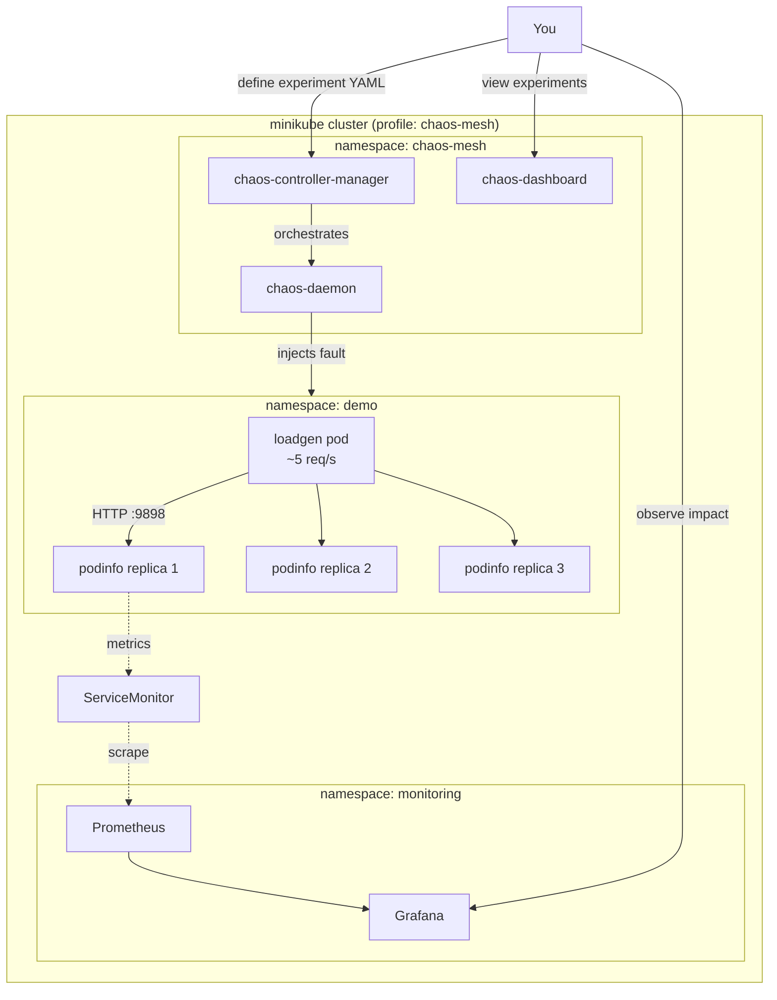
```mermaid
flowchart TB
    subgraph cluster["minikube cluster (profile: chaos-mesh)"]
        subgraph demo["namespace: demo"]
            LG[loadgen pod<br/>~5 req/s]
            P1[podinfo replica 1]
            P2[podinfo replica 2]
            P3[podinfo replica 3]
            LG -->|HTTP :9898| P1
            LG --> P2
            LG --> P3
        end

        subgraph mon["namespace: monitoring"]
            PROM[Prometheus]
            GRAF[Grafana]
            PROM --> GRAF
        end

        subgraph chaos["namespace: chaos-mesh"]
            CM[chaos-controller-manager]
            CD[chaos-daemon]
            DASH[chaos-dashboard]
        end

        SM[ServiceMonitor] -.scrape.-> PROM
        P1 -.metrics.-> SM
        CM -->|orchestrates| CD
        CD -->|injects fault| demo
    end

    USER[You] -->|define experiment YAML| CM
    USER -->|observe impact| GRAF
    USER -->|view experiments| DASH
```

**Flow:** `loadgen` hammers `podinfo` continuously → Prometheus scrapes podinfo
metrics via a `ServiceMonitor` → Grafana renders throughput & p99 latency →
Chaos Mesh injects faults → you watch the graphs to see whether the system holds.

---

## Tech stack

| Layer | Tool |
|-------|------|
| Local Kubernetes | minikube (docker driver), Kubernetes v1.35 |
| Target app | podinfo (Stefan Prodan's reference microservice) |
| Load generation | busybox `wget` loop |
| Monitoring | kube-prometheus-stack (Prometheus + Grafana) |
| Chaos platform | Chaos Mesh v2.8 (PodChaos, NetworkChaos) |
| Packaging | Helm |
| Environment | Windows 11 Pro, Git Bash (MINGW64), Docker Desktop |

---

## Repository structure

```
12-chaos-engineering-chaos-mesh/
├── README.md
├── LICENSE
├── .gitignore
├── manifests/
│   ├── monitoring-values.yaml     # lightweight kube-prometheus-stack overrides
│   ├── loadgen.yaml               # synthetic traffic generator
│   └── rbac-dashboard.yaml        # ServiceAccount + ClusterRole + binding for the dashboard
└── experiments/
    ├── 01-pod-kill.md             # hypothesis + result (PASS)
    ├── 01-pod-kill.yaml
    ├── 02-network-delay.md        # hypothesis + root-caused limitation
    └── 02-network-delay.yaml
```

---

## Walkthrough

### Phase 0 — Cluster

A dedicated minikube profile (`chaos-mesh`) with enough resources for monitoring +
app + chaos to coexist without scheduling pressure.

```bash
minikube start -p chaos-mesh --cpus=4 --memory=6144 --driver=docker
```

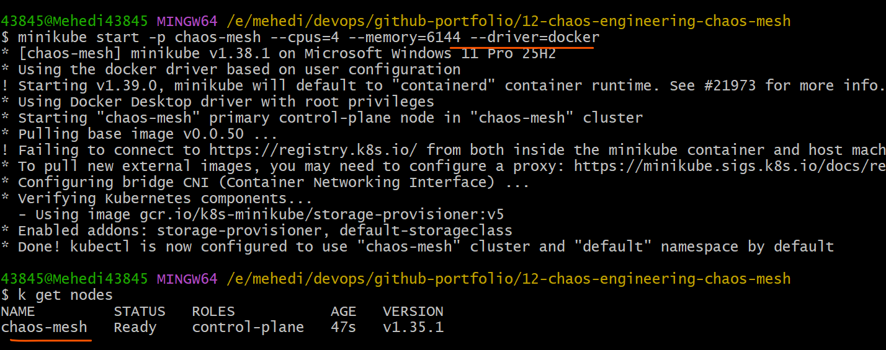

### Phase 1 — Monitoring (the "eyes")

Add the Helm repo and install kube-prometheus-stack with a trimmed values file
(Alertmanager off, short retention, modest requests) so it stays light on minikube.

```bash
helm repo add prometheus-community https://prometheus-community.github.io/helm-charts && helm repo update
```

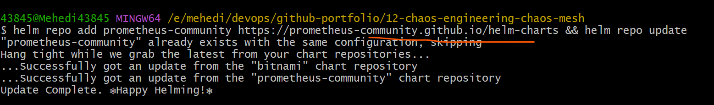

`manifests/monitoring-values.yaml`:

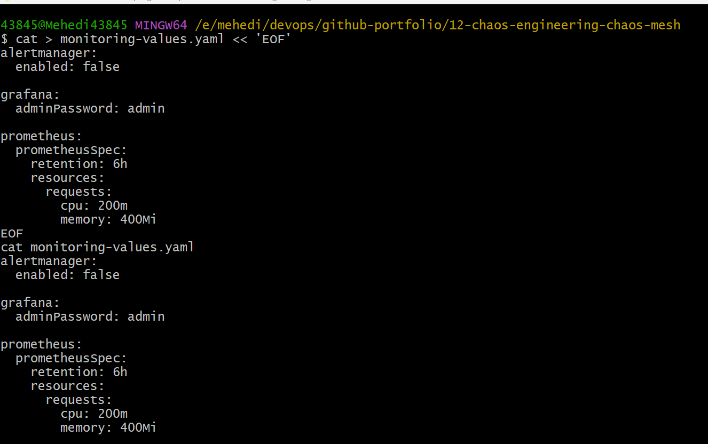

```bash
helm install monitoring prometheus-community/kube-prometheus-stack \
  -n monitoring --create-namespace -f manifests/monitoring-values.yaml
```

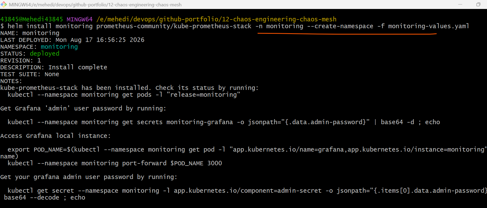

All monitoring components healthy:

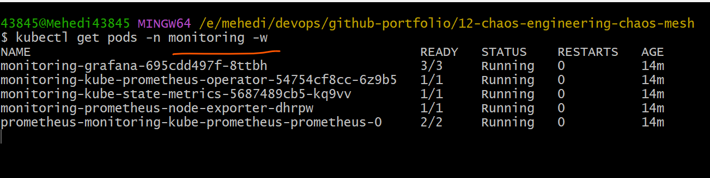

Expose Grafana (docker driver needs a tunnel URL, not port-forward):

```bash
minikube service monitoring-grafana -n monitoring -p chaos-mesh --url
```

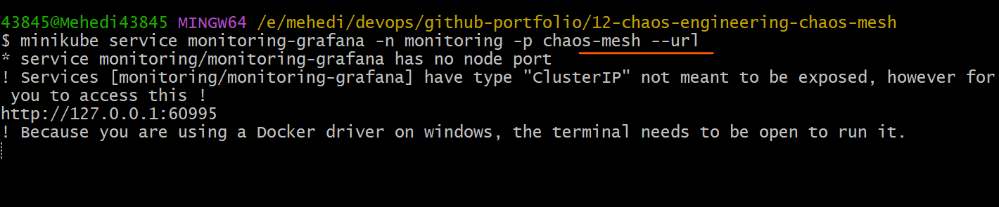

### Phase 2 — Target app + traffic

Install podinfo with 3 replicas and start a load generator so faults have visible impact.

```bash
helm repo add podinfo https://stefanprodan.github.io/podinfo && helm repo update
```

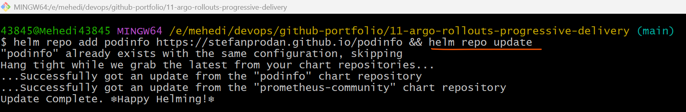

podinfo (3 replicas) + loadgen:

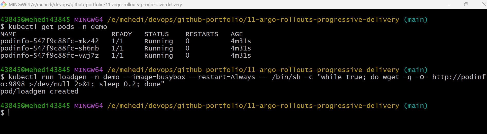

Load generator running (deployed via `manifests/loadgen.yaml`):

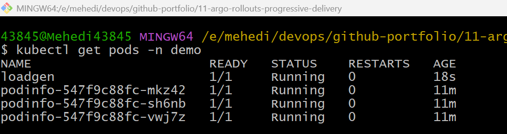

Enable podinfo's `ServiceMonitor` **with the `release: monitoring` label** so
Prometheus actually discovers it (a classic gotcha — without the label the
ServiceMonitor exists but is invisible to Prometheus):

```bash
helm upgrade podinfo podinfo/podinfo -n demo \
  --set replicaCount=3 \
  --set serviceMonitor.enabled=true \
  --set serviceMonitor.additionalLabels.release=monitoring
```

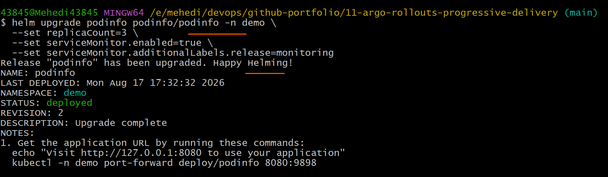

Steady-state throughput baseline in Grafana (`sum(rate(http_requests_total{namespace="demo"}[1m]))` ≈ 5 req/s):

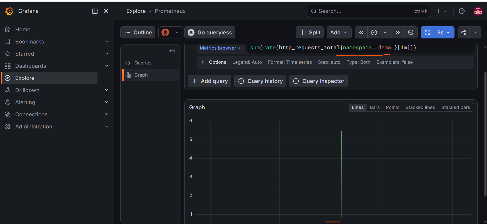

ServiceMonitor carrying the required `release=monitoring` label:

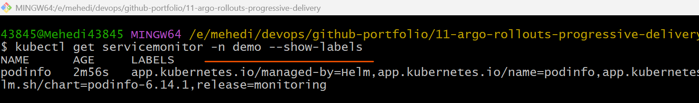

### Phase 3 — Chaos Mesh

Install Chaos Mesh, pointing it at the correct container runtime socket.

```bash
helm repo add chaos-mesh https://charts.chaos-mesh.org && helm repo update
```

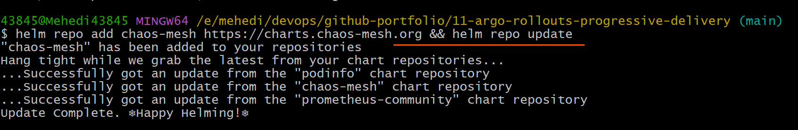

```bash
helm install chaos-mesh chaos-mesh/chaos-mesh -n chaos-mesh --create-namespace \
  --set chaosDaemon.runtime=containerd \
  --set chaosDaemon.socketPath=//run/containerd/containerd.sock
```

> **Note the `//` in the socket path.** On Git Bash, a leading `/run/...` gets
> mangled into a Windows path (`C:/...Git/run/...`), which makes the chaos-daemon
> fail with `CreateContainerError`. A double leading slash (`//run/...`) survives
> Git Bash untouched and is read by Linux as the same absolute path.

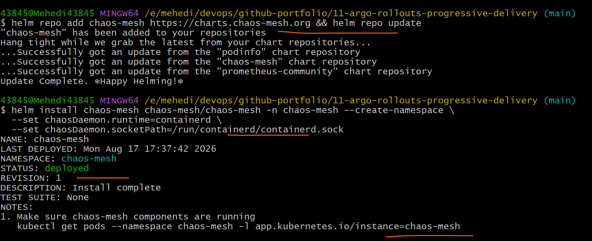

All Chaos Mesh components up, plus the dashboard tunnel URL:

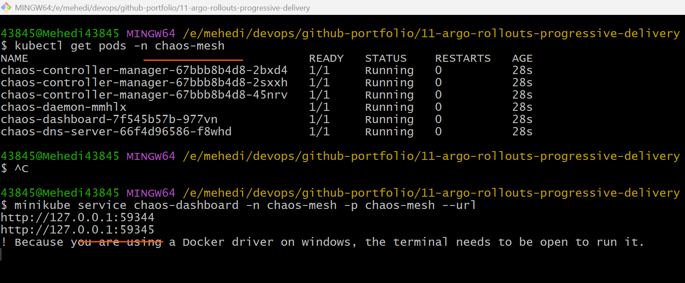

The dashboard requires an RBAC token:

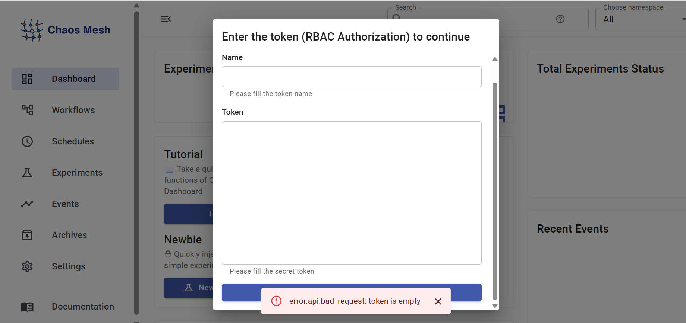

Create a ServiceAccount with chaos permissions (`manifests/rbac-dashboard.yaml`):

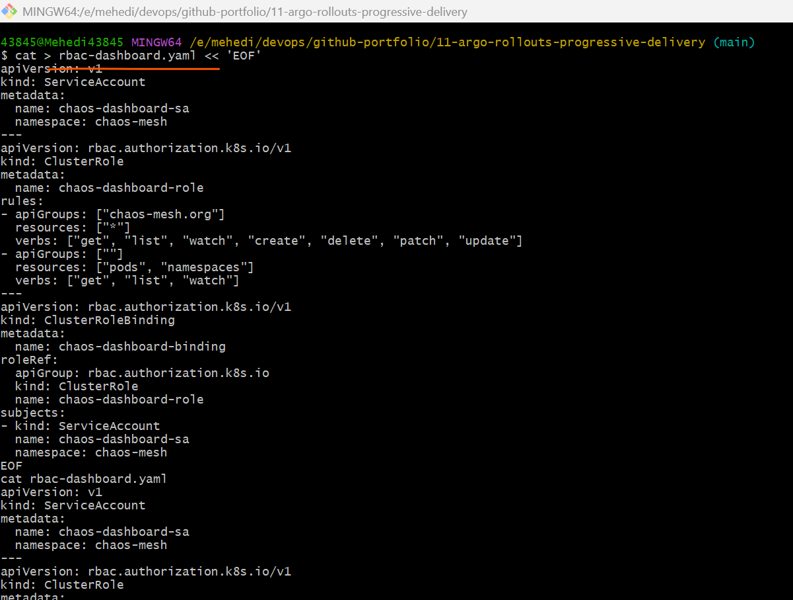

Apply it and mint a short-lived token (token redacted below):

```bash
kubectl apply -f manifests/rbac-dashboard.yaml
kubectl create token chaos-dashboard-sa -n chaos-mesh
```

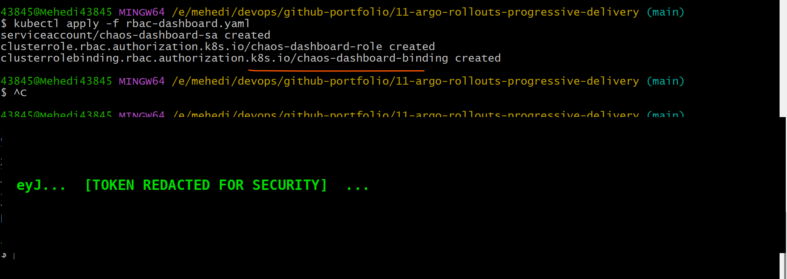

Logged in — a clean slate, ready for experiments:

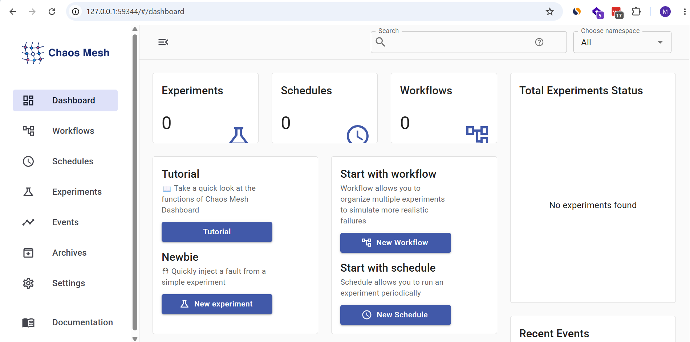

### Phase 4 — Experiments

#### Experiment 01 — Pod Kill ✅ (PASS)

Hypothesis first (`experiments/01-pod-kill.md`):

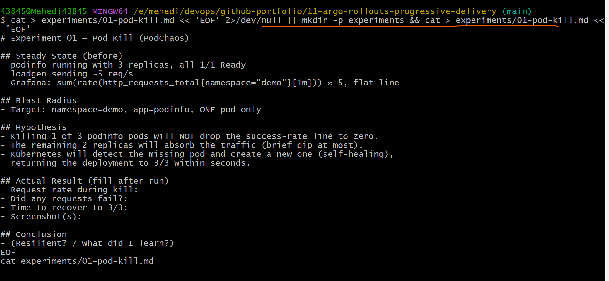

The `PodChaos` manifest — kills exactly **one** of the three podinfo pods:

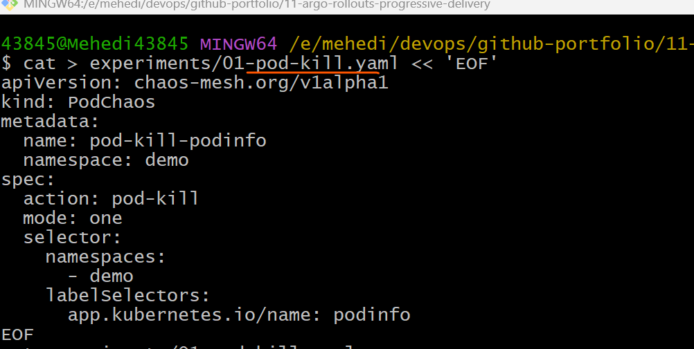

Verify the selector label matches before injecting (avoids a silent "no target" run):

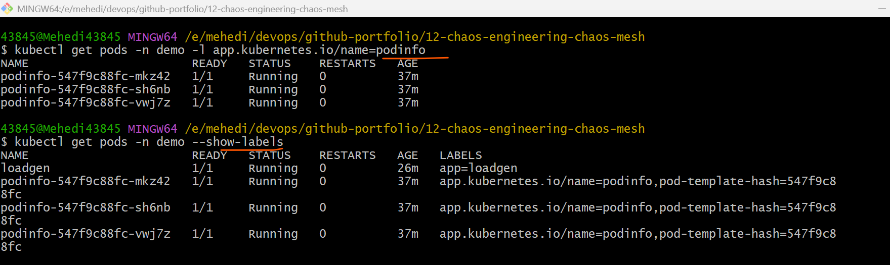

**Result in Grafana:** a small notch, but the throughput line **never hit zero** —
the remaining two replicas absorbed the traffic:

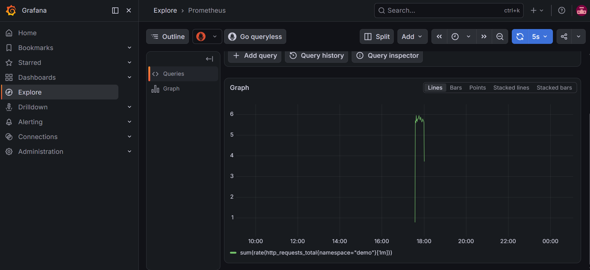

**Result in the dashboard:** experiment `Completed`, and Kubernetes recreated the
killed pod (self-healing back to 3/3 within seconds):

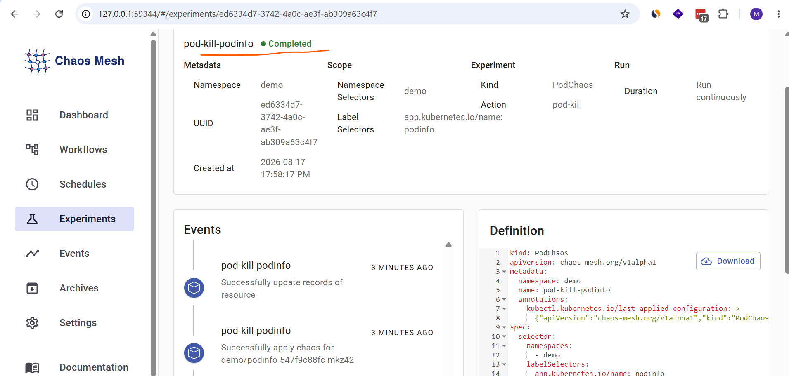

Clean up the experiment object:

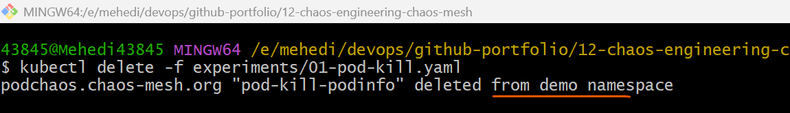

> **Takeaway:** With 3 replicas, a single pod kill is nearly invisible to users,
> and Kubernetes' desired-state reconciliation restores capacity automatically.
> Three is the smallest replica count that makes resilience *demonstrable*.

#### Experiment 02 — Network Delay ⚠️ (Attempted → root-caused a limitation)

Latency baseline before the run — p99 ≈ 5 ms:

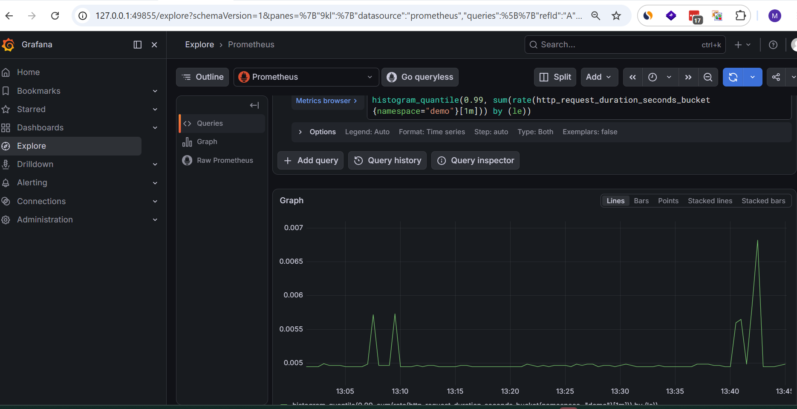

After applying the `NetworkChaos` object, **latency stayed flat at ~5 ms** — the
delay was never actually injected:

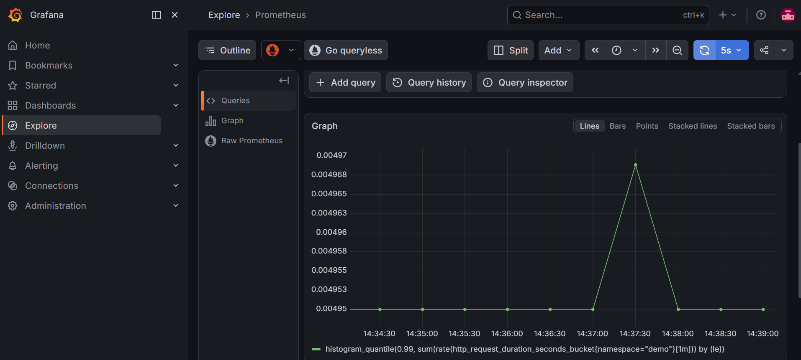

**Root cause:** on minikube's **docker driver**, `NetworkChaos` needs `ipset`/`tc`
operations inside the pod network namespace, and the chaos-daemon failed with
`unable to flush ip sets`. The container-in-container docker driver doesn't expose
the kernel network capabilities these need. `PodChaos` worked because it only kills
a process. **Fix for a real run:** use a VM-based driver (Hyper-V / VirtualBox) or
`kind`. Full write-up: [`experiments/02-network-delay.md`](experiments/02-network-delay.md).

---

## Key Learnings

- **Chaos needs observability first.** Without a Grafana baseline, a pod kill is
  just an outage — you can't tell whether the system absorbed it.
- **3 replicas is the minimum for a meaningful resilience demo.** One replica = an
  outage; three lets survivors carry the load while Kubernetes self-heals.
- **The `release: monitoring` label is mandatory** for a ServiceMonitor to be seen
  by kube-prometheus-stack. Without it the metric silently never appears.
- **Git Bash path-mangling is real.** A leading Unix path (`/run/...`, `/bin/sh`)
  becomes a Windows path inside Git Bash. Use YAML manifests instead of inline
  `-- /bin/sh -c`, and use `//run/...` for Helm socket paths.
- **Chaos Mesh won't let you update a running experiment** (`Cannot update chaos spec`).
  To change parameters: `delete` → edit → `apply`. This is an intentional safety guard.
- **A fault can "run" while injecting nothing.** Always confirm the fault landed
  (daemon events / the metric you expect to move) before trusting the result.
- **Tooling has an environment envelope.** `NetworkChaos` needs kernel network
  capabilities the docker driver doesn't provide — a VM driver or `kind` is required.
- **Finalizers can trap resources.** A controller that can't finish cleanup leaves the
  object stuck `Terminating`; clearing the finalizer force-releases it.

---

## Cleanup

```bash
# Remove any lingering experiments
kubectl delete networkchaos --all -n demo
kubectl delete podchaos --all -n demo

# Tear down the whole cluster (frees all resources)
minikube delete -p chaos-mesh
```

---

## Next steps

- Re-run the Network Delay experiment on a VM-based driver (Hyper-V) or `kind` to
  see the p99 latency spike and throughput drop as predicted.
- Add more fault types: CPU/memory `StressChaos`, DNS chaos, and Chaos **Workflows**
  (chaining multiple faults to simulate realistic incidents).
- Explore alternatives: LitmusChaos, and AWS FIS for cloud-native chaos on EKS.

---

## Notes on secrets

The RBAC token in `18-rbac-apply-token-redacted.png` is intentionally blacked out.
Never commit real ServiceAccount tokens, kubeconfigs, or credentials to a public repo.
# chaos-engineering-chaos-mesh
